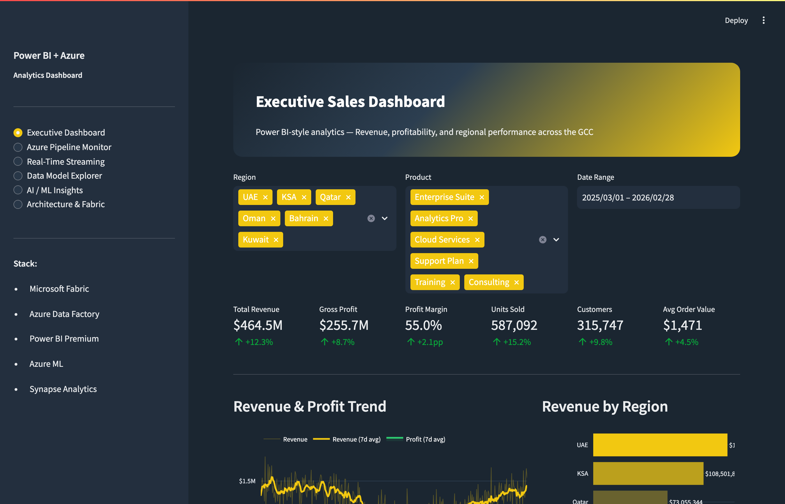

# Power BI + Azure Analytics Dashboard Demo

An interactive Streamlit application demonstrating a **Power BI-style executive analytics dashboard** — built on the Microsoft Azure ecosystem with real-time streaming, DAX measure libraries, AI/ML insights, and Microsoft Fabric architecture.

**[View Live Demo](https://anualli-demo-powerbi-azure-dashboard.streamlit.app)**

---

## What This Project Demonstrates

This demo simulates a production enterprise analytics platform for a GCC-region business, showcasing:

- **Executive Sales Dashboard** (Power BI-style) with filterable KPIs, revenue trends, regional heatmaps, product mix donut charts, and top-performing segment tables — designed for the UAE/GCC market
- **Azure Pipeline Monitor** with ADF pipeline status grids, run history charts, throughput/cost analysis, and full ARM template pipeline definitions
- **Real-Time Streaming** with transactions-per-second, latency monitoring, error rate tracking, system health gauges, and Azure Stream Analytics anomaly detection queries
- **Data Model Explorer** with interactive star schema visualization, table/column details for a 7-table dimensional model, and a comprehensive DAX measures library (revenue, time intelligence, KPIs, advanced Pareto analysis)
- **AI/ML Insights** including 90-day revenue forecasting with confidence intervals, anomaly detection with 2-sigma bands, K-Means customer segmentation (RFM analysis), and Key Influencers analysis
- **Architecture & Fabric** with an end-to-end Sankey diagram covering 5 source systems → ADF/Event Hub → ADLS/Lakehouse/SQL DW → Databricks/Notebooks → Power BI/APIs, plus Microsoft Fabric workload descriptions and PySpark notebook examples

The app generates 365 days of GCC sales data across 6 regions and 6 product lines.

---

## Screenshots

### Executive Dashboard
Power BI-style KPIs, revenue trends, regional performance, product mix, and monthly heatmaps.


### Azure Pipeline Monitor
ADF pipeline status grid, run history, throughput scatter plots, and cost trends.


### Real-Time Streaming
TPS, latency, error rate, active sessions, and system health gauges with SLA thresholds.


### Data Model Explorer
Star schema visualization, table details, and comprehensive DAX measures library.


### AI / ML Insights
Revenue forecasting, anomaly detection, customer segmentation, and key influencers analysis.



### Architecture & Fabric
End-to-end Sankey architecture diagram, Microsoft Fabric workloads, and PySpark notebook examples.


---

## Tech Stack

- **BI:** Power BI Premium, DAX
- **Cloud:** Microsoft Azure, Microsoft Fabric
- **Pipelines:** Azure Data Factory, Azure Stream Analytics
- **Processing:** Databricks, PySpark, Synapse Analytics
- **Streaming:** Azure Event Hub
- **ML:** Azure ML, K-Means clustering, time-series forecasting
- **Visualization:** Streamlit, Plotly
- **Languages:** Python, SQL, DAX, PySpark

## Run Locally

```bash
pip install -r requirements.txt
streamlit run app.py
```

## License

MIT
